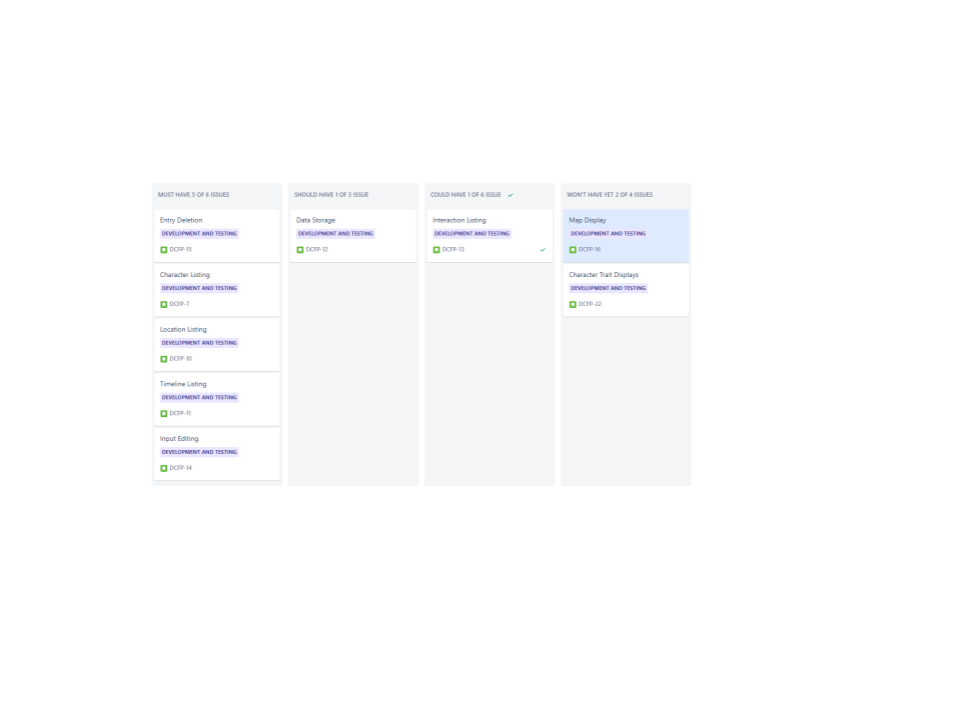
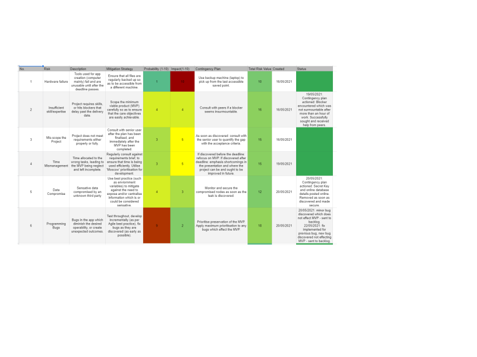
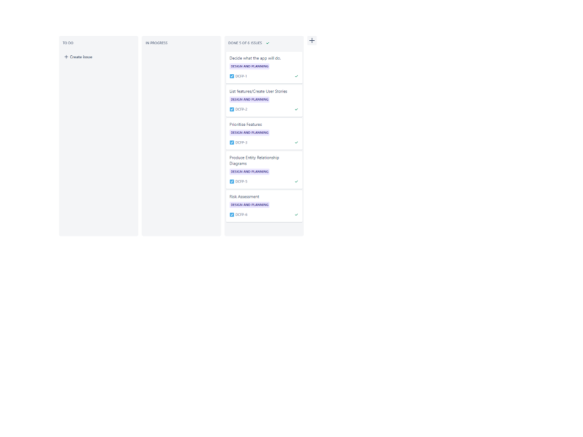
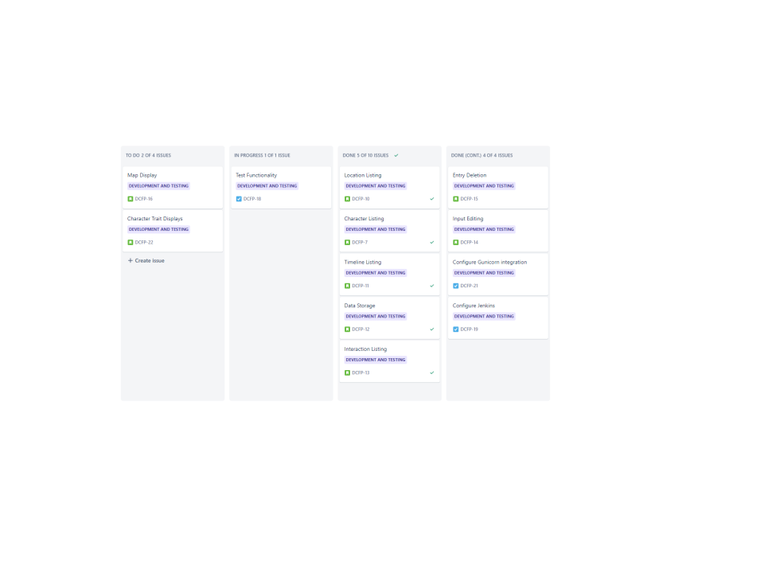
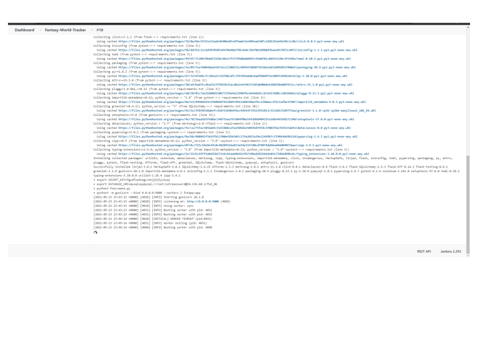
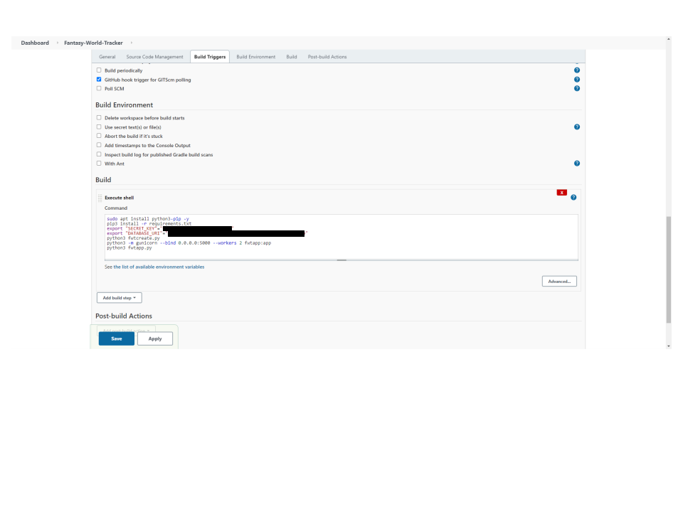
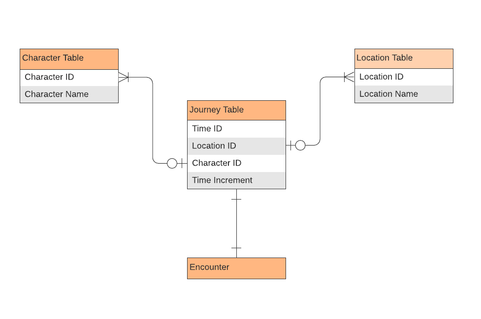
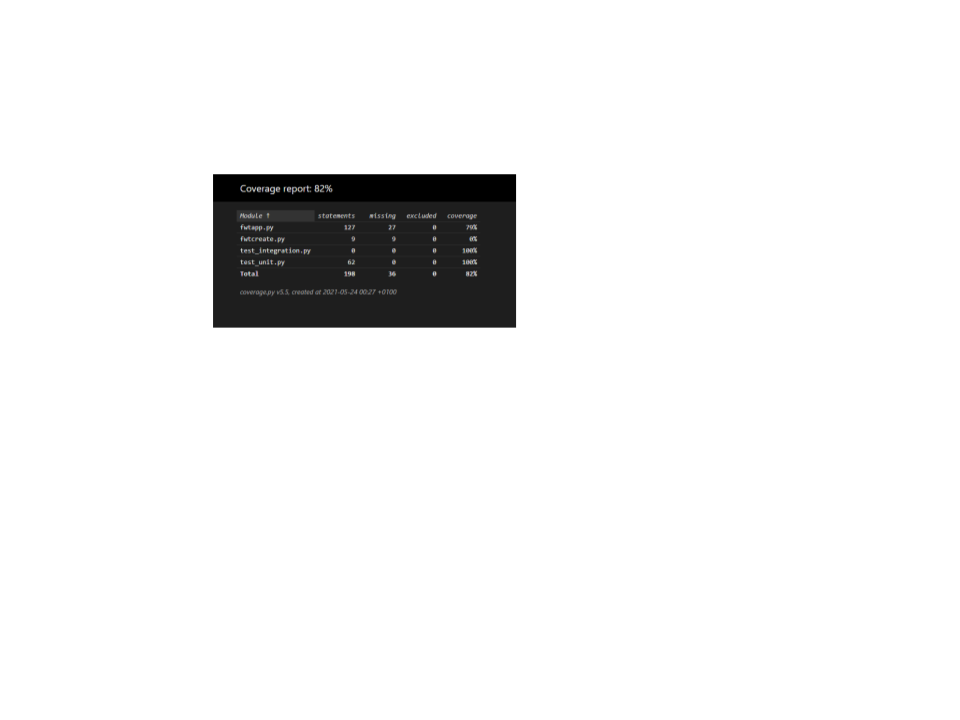
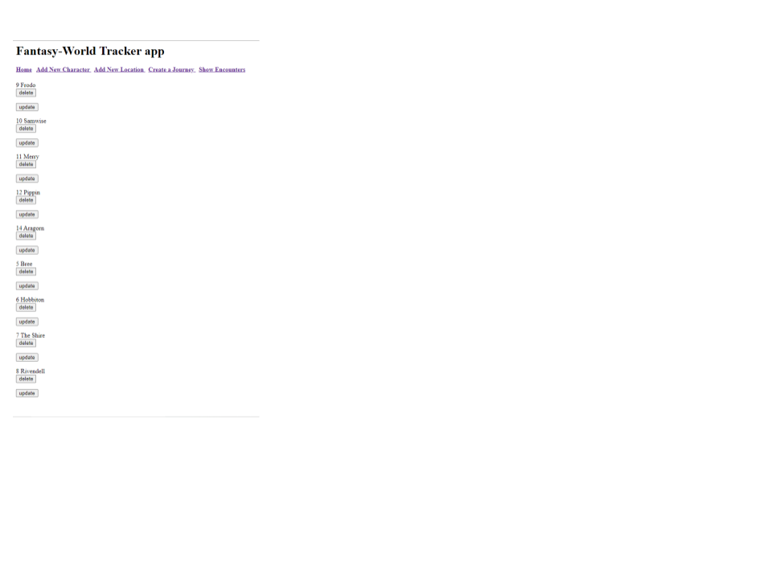
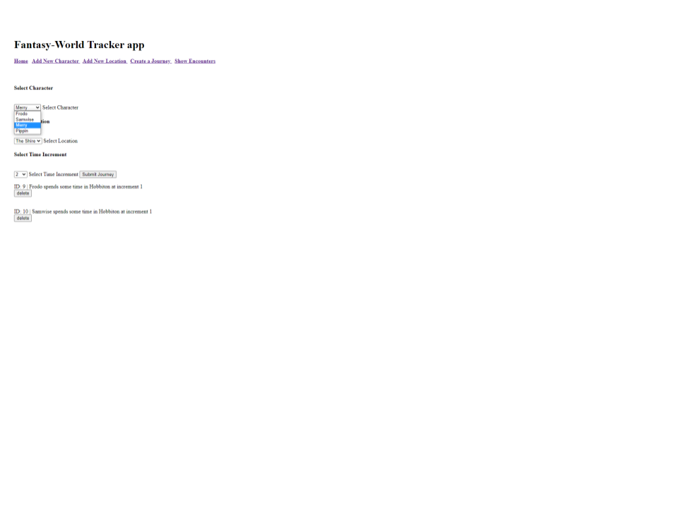

# Fantasy Tracking Tool

## Purpose
The aim of the app is to assist fiction writers in maintaining logical continuity within their worlds, particularly when a lot of characters are involved.

## Approach and Scope
In order to achieve this aim, I decided to create an app which would accept variable inputs of names of characters and places involved in the story, along with an arbitrary time segment selector.
Through the use of these simple inputs, the app would be able to accept journeys constructed by the user to track where characters are a different points in the story, and when they will overlap, invariably (according to expectations in literature/fiction) generating an interaction of some kind.
Ideally then, the app would also flag these interactions as an extra layer of functionality to the user, though this is a quality of life imporvement, rather than a necessity to core functionality.
Likewise other features would be useful to improve the usefulness of the app - including options to upload a map as a visual aid to constructing the journeys and stories, and also a tracker for alignment or character temperment which can help to inform what sort of interaction to expect (for example if the antagonist encounters the protagonist, it would flag as conflict, as opposed to friendly or neutral characters encountering one another). Likewise however, these are ancilliary features to the core functionality.

What this app clearly cannot do, however, is to fully interpret these interactions into a story, or provide any particular creative input. Those are entirely down to the user, as is the interpretation of the results presented. The app can help to free up some mental computing power and potentially extensive notes to be better used on the particulars of the story, rather than the generic issues common to many stories of tracking the characters in time and space.

## Project Structure
With the aims established, they were organised into a set of user stories, and categorised according to their importance to the functionality of the app.

In addition, a risk assessment was performed, and corresponding doccument generated - which pointed to issues of time management and lack of experience (interlinked risks, as it happened) being the biggest risks to the project, and so the proposed structure was altered slightly from one which frontloaded the most important elements of the project - to one which attempted to build a working baseline structure for every component which could be expanded on if and when consultations with subject matter experts were no longer available. To look ahead however, although this approach mitigated the risk significantly - successfully through the additional use of contingency plans, some residual risk remained in these areas of concern which did indeed come to fruition. A link to the Risk Assessment can be found [here](https://docs.google.com/spreadsheets/d/1RoVwB99a2Wc12L_wGFmwLCbnmv7NkNodOtFWWMf9hC8/edit?usp=sharing).

Agile development principles were adhered to; integrating consistent testing imbedded within the development process, developing incrementally from the minimum viable product upwards into other desireable features but maintaining a constant delivery date, by extension making use of feature prioritisation through the MoSCoW model, and a Kanban board. This was achieved using the project management platform: Jira. Screenshots below.

This apporach was altered slightly however, as previously stated, due to the unequal availability of subject matter expertise. The standard best practice was therefore tailored during the first half of the sprint - to prioritise some minimally functional version of all attainable features (some beyond the scope of the MVP), before refocusing on the MVP in the second half of the sprint. The rewards for this approach are shown in the risk assessment, as problems were addressed before they became insurmountable.

## Archetecture
The app is primarily built with Python and HTML, using the tools; Flask, WTForms, Jinja2, and SQL Alchemy to gain access to specific capabilities such as SQL integration, html enabled forms, and dynamic displays.

As demonstrated in the following screenshots, the app is run via the Google Cloud Platform, and a Jenkins automation server, using a gunicorn Web Server Gateway Interface for maximum performance across muliple instances (this is only set to two in the current setup, but is configurable for more). Additionally, it is configured to store data on a dedicated GCP SQL server. 

Through the combination of all of these technologies, the app can achieve maximum performance, uptime, and security, with the added benefit of automatic hooking from the relevant GitHub (version control tool) repository, prompting new builds by Jenkins when it detects that a newer version of the app has been uploaded. 

At a more granular level, in terms of entity relationship modelling; the app has been structured to accept string inputs for the names of both locations and characters, assinging corresponding IDs, which are then passed to the Journey table and tied to a time ID, and a time increment to tied the characters to a place and time. This is shown in the following ERD:

It was expected earlier in development that a fourth table would have been required, corresponding to the Encounters, but this was deemed unnecessary, as the same aim was achieved through logic functions - simplifying development somewhat. 

## Results: Testing

Using the Pytest module, I was able to achieve 79% unit test coverage for the primary app file, covering most of the major functionality. Further testing efforts were deemed to be more pressingly needed elsewhere, as the integration testing functionality which had been expected - was and continues to be non-functional. Further work on the app would necessitate this area being of primary importance before additional functionality is added.
Of the tests successfully conducted; the main areas of creation, reading, and parts of editting are covered, which - in combination with user testing, was deemed to sufficiently meet the MVP requirements under the time constraints in place. These test results do, however, only test the raw functionality of the app, and fail to convey the lacklustre UI, which are a definite area for improvement. Further details regarding the tests conducted are available in the HTMLcov folder of the repository.

## Results: Functionality Achieved
Informally testing yields much more apparent success - meeting the Must have, Should have, and Could have requirements.
From any page, the index, add character, add location, create journey, and show encounters pages are available via hyperlink, and there are no restrictions or set order on how to enter the data. If the user so wishes, they can enter a few characters at a time, setting up journeys as they go, and the encounters function will update accordingly, showing new encounters as they appear. Each screen in use is shown as follows:

Adding characters.

Adding locations.

Viewing all stored characters and locations.

Editting entires.

Selecting characters, locations, and time increments from dynamic dropdown menus.

Finally: getting a list of encounters - albeit with double listings.

## Potential Future Development
- Implimentation of the desired map upload system
- Aesthetic improvements to streamline and beautify the UI
- Options for generic character dispositions which would change the encounters output depending on whether the character was; for example, passive/submissive versus aggressive/belicose. Perhaps adding factional alignment as well for greater depth.
- Login system which allows different accounts to store parallel user data

## Known Issues
- Removing characters and locations does not automatically delete the associated journeys, which need to be deleted seperately
- Duplicate entries are allowed
- Characters are capable of being in two different places at the same time - setting a time increment does not lock the character to that place at that time.
- Encounters are calculated from both sides - meaning that each encounter is effectively displayed twice; once from each perspective.

## Retrospective and Lessons
- The Agile structure, and formal risk management procedure yielded great benefits to the structure of the project. Due to the codified and weighted concerns, alongside a formal look at the planning and structure of the project, adjustments were made which potentially saved the MVP from poor riskmanagement strategies which could have compromised it, and by extension the whole project.
- Each technical component ought to be considered independently, rather than each technical area, as the unique challenges of integration testing made manifest the risk of insufficient expertise which had otherwise been properly mitigated elsewhere. This was done under the faulty assumption that a functional unit testing baseline would serve as foundation for later integration testing, but the latter yielded unique problems.

## Author
Alex Coates

## Contributions
Many thanks to Ben Hesketh, and Harry Tindale for their invaluable consulted expertise
